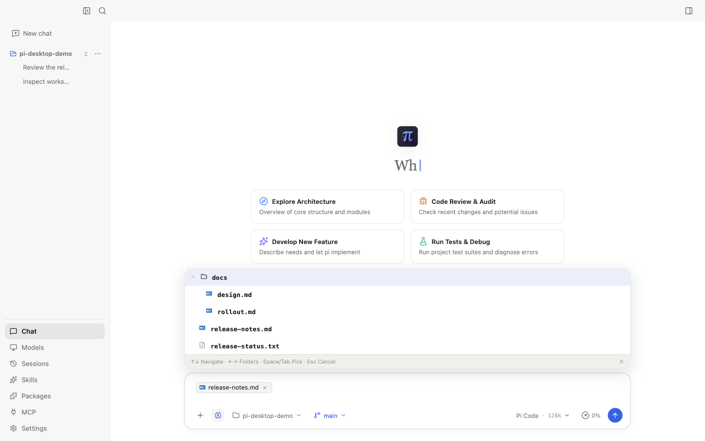
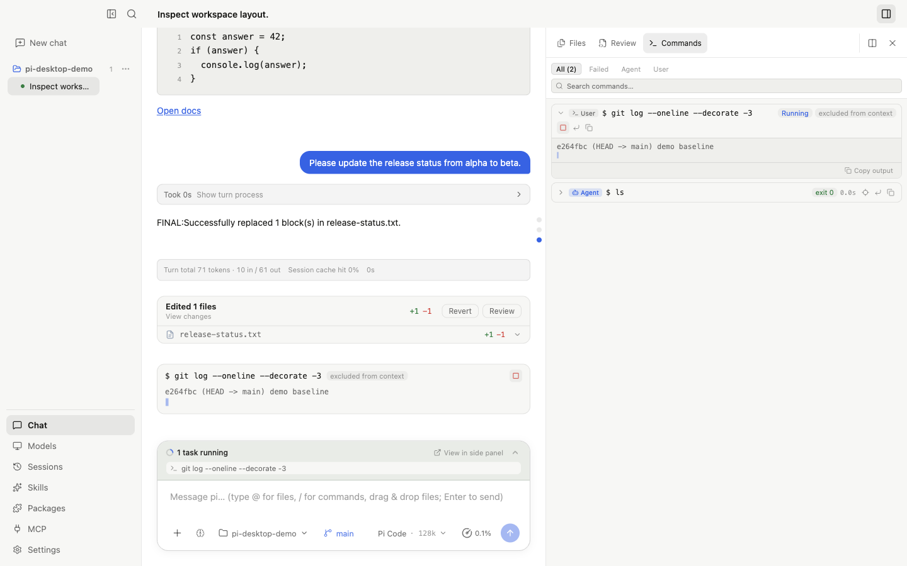
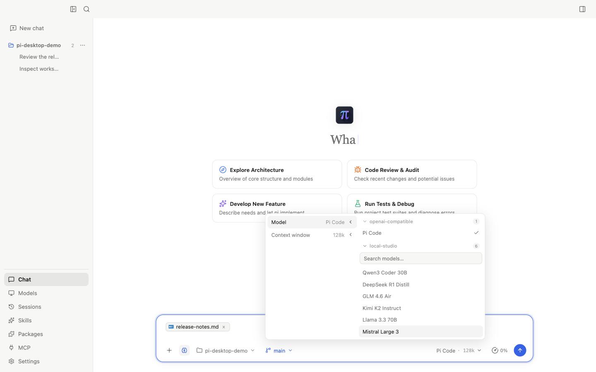
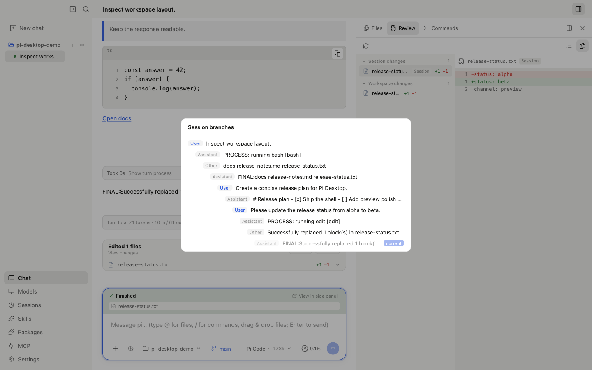
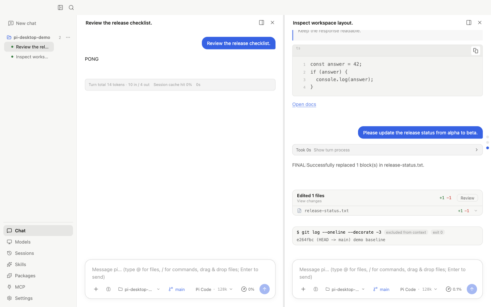
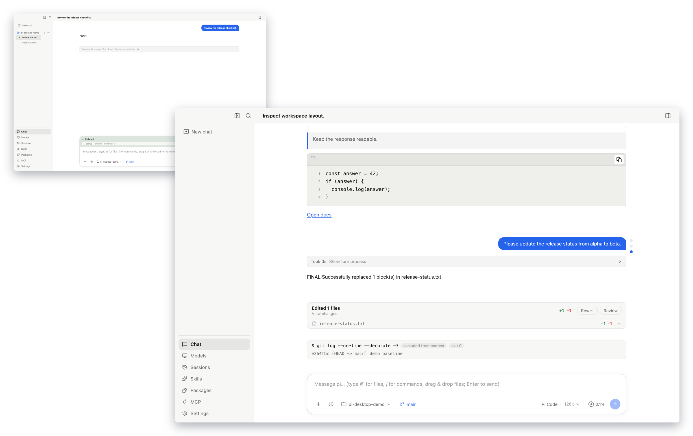

<div align="center">
  
  <h1>Pi Desktop</h1>
  <p><strong>为 pi coding agent 打造的桌面工作台。</strong></p>
  <p>流式对话、逐 hunk 评审改动、直接运行 shell 命令，并用分栏与多窗口同时推进多个会话。</p>
  <p>
    <a href="README.md">简体中文</a> ·
    <a href="README.en.md">English</a>
  </p>
  <p>
    <a href="https://github.com/zth0828/pi-desktop/actions/workflows/ci.yml"></a>
    <a href="https://github.com/zth0828/pi-desktop/releases"></a>
    <a href="LICENSE"></a>
  </p>
</div>

Pi Desktop 让 [pi](https://github.com/badlogic/pi-mono) 在桌面上有了一个真正的家：
带 Plan mode、Skills 和文件附件的流式对话；并排工作台，可预览文件、逐 hunk
评审改动、记录每一条运行过的 shell 命令；像项目资产一样的会话——可搜索、可
fork，多任务时可以分栏或拆成独立窗口；以及覆盖整个模型栈的控制界面，从
API Key、OAuth 到本地服务器。

一切都运行在你全局安装的 pi 之上。会话、凭证、Skills、Packages 和设置都保留在
pi 原生的位置与格式，你在这里完成的工作与 pi CLI 及整个生态完全兼容。

> [!IMPORTANT]
> Pi Desktop 运行在你已有的 pi 之上：加载全局安装的 pi SDK，继续使用 pi 原生的
> 配置、凭证和会话文件——不 fork、不替换、不锁定。项目仍在积极开发，当前下载
> 版本为未签名预览包。


## 为什么使用 Pi Desktop

### 一个完整的编码闭环，而不是互不相关的页面

让 pi 调查项目，实时查看它的工作过程和工具调用，在同一窗口检查文件与 diff，
然后继续当前会话。对话、工作区和改动评审始终相互关联。

### 为并行工作而生

把窗口拆成分栏，把会话拆成任意多个独立窗口，同时推进所有对话。流式输出、
通知和焦点都会跟随每个会话去到正确的窗口。

### 完全 pi 原生，零锁定

应用接触的每个会话、每项设置和凭证都保留在 pi 原生的格式与位置。Pi Desktop
直接适配 pi 的 SDK、事件、包管理器和扩展系统，你可以在 CLI 与桌面端之间自由
切换，不丢任何东西。

### 自由选择模型与供应商

可以使用 pi 内置供应商、API Key 或 OAuth、自定义 OpenAI 兼容端点、LM Studio 等
本地服务，以及 pi 扩展注册的 Provider。界面中可查看上下文限制和价格、探测自定义
连接，并切换当前模型。

### 本地优先的项目控制

工作区、pi 配置、凭证和会话历史都保留在原生本地位置。Pi Desktop 从用户环境动态
定位 Node.js、npm 和 pi，不会再捆绑一套隐藏运行时。

### 直接接入 pi 生态

Skills、Prompt 模板、主题、扩展和 MCP 仍然使用 pi 原生机制。Pi Desktop 提供发现
与配置体验，实际安装和执行继续交给 pi。

## 功能全景

| 领域 | 核心能力 |
| --- | --- |
| **Agent 对话** | • 流式文本与思考过程实时呈现<br>• 右侧消息导航轨（悬浮问题预览、长会话智能折叠、秒级精准定位）<br>• 历史回合智能聚合折叠（思考与工具过程折叠、分秒耗时统计、尾部一键快速收起）<br>• 停止、排队与插队发送（Steer / Queue）<br>• 斜杠命令、Plan mode 开关、消息原地编辑与 Fork<br>• Bash 命令模式（独立执行、可控是否并入上下文）<br>• 富 Markdown、代码高亮复制、任务清单与表格<br>• 工作区 `@` 树状文件引用与多图片附件预览 |
| **工作区** | • 停靠并排（Dock）与覆盖浮层（Overlay）双模式布局，支持窗口向右扩展<br>• 全格式内置预览：代码、Markdown、PDF（分页缩放）、DOCX、XLSX、CSV、图片<br>• 支持调用本机默认应用打开<br>• 会话级 Bash 运行历史时序记录（Commands 标签页） |
| **改动评审** | • Git 与非 Git 工作区改动检测（staged / unstaged / untracked / conflict）<br>• 双栏（Split）与统一（Unified）Diff 视图对比<br>• 文件级与单个 Hunk 级的确认与精准回滚<br>• 历史回合编辑文件汇总卡片（直观展示增删行数，支持单轮改动一键还原） |
| **会话管理** | • 按项目组织会话历史，支持分组展开/折叠与状态感知<br>• 全局会话标题与消息内容实时模糊搜索<br>• 可视化会话分支树（Fork Tree：拓扑结构一览、分叉深度、跨分支自由穿越）<br>• 会话归档、恢复、重命名与安全删除<br>• 上下文智能压缩检查点与独立单文件 HTML 导出 |
| **模型管理** | • 原生与扩展 Provider、API Key、OAuth 快速授权、自定义兼容端点探测<br>• 模型发现、上下文窗口与输出上限、Token 价格与用量费用测算<br>• 思考等级（Thinking Level）平滑调节<br>• 供应商错误智能归属诊断（401/429/500 等异常原因分析与排查指引）<br>• 输入框模型选择器支持按供应商分类与快速搜索过滤 |
| **pi 生态** | • 动态加载当前 Skills 列表与说明卡片<br>• 浏览官方包仓库、查看元数据与 README、安装/更新/卸载<br>• 全局与项目级 MCP Server 图形化配置<br>• 渲染受支持的扩展对话框、原生 Widget 与桌面通知 |
| **桌面体验** | • 浅色 / 深色 / 跟随系统主题，中英文界面无缝切换<br>• 磁吸拖拽多面板分栏与任意数量的独立多窗口并行运行<br>• 会话搜索与命令快捷键、可收起侧边栏<br>• 桌面通知策略、发送行为定制、系统阻止休眠<br>• 应用版本更新检测、Release Notes 预览与下载镜像加速<br>• Node.js / npm / pi 本地环境自动诊断与引导 |

## 产品导览

### 一边对话，一边评审代码


右侧工作台让源文件和改动始终贴近对话。历史回合自动将中间思考与多步工具调用折叠为易读的紧凑记录，并准确统计分秒耗时；长会话右侧提供常驻的消息导航轨，悬浮可秒览原问题，点击平滑直达目标；每轮修改完毕后自动生成改动卡片，支持一键还原；编辑过的文件在右侧工作区持续可见，方便随时进行逐 Hunk 精细评审。

### 从输入框工具栏驱动会话



Plan mode、Skills、工作区与 git 分支切换、模型选择都固定在常驻工具栏上。`@` 引用面板以树状结构浏览整个工作区，支持将任意代码或文档文件暂存为消息附件；支持在流式生成中随时排队发送或插队引导（Steer / Queue），不打断正常节奏。

### 在对话旁直接运行 shell 命令



命令模式从输入框直接执行 bash 命令，可一键将终端输出排除在模型上下文之外。运行可独立于对话回合停止，工作区 Commands 标签页保留每条命令的退出码与完整日志，并支持一键定位回对话中的发起位置。

### 为每个项目选择合适的模型栈


凭证仍保存在 pi 原生存储中。Pi Desktop 为 Provider 状态、可用模型、上下文窗口、输出限制和当前模型提供清晰的管理界面；当遇到 401 凭证失效、429 配额用尽等异常时，智能归属诊断会给出精准排查指引。

会话中可随时从 composer 选择器切换模型，按供应商分组并支持组内搜索：



### 把会话当作长期项目资产


会话不是一次性的聊天标签。你可以随时继续旧工作、归档已完成的任务，或者导出一份包含完整样式的高保真独立 HTML 记录。在对话任意节点点击 Fork 后，通过内置的「会话分支树」弹窗，可以清晰审视整个会话派生的完整拓扑脉络与分叉深度，并在不同实现思路间自由穿梭：



### 用分栏与多窗口并行推进



把会话拖到面板边缘即可实现磁吸分栏，左右并排跟进两段对话，各自保持独立的流式状态与工作区绑定。



需要更大空间时，可以把任意多个会话拆成独立窗口——两个、三个，甚至更多。每个窗口都独立流式工作，点击桌面通知可直接聚焦发起它的那个会话。

### 通过 pi Packages 扩展能力


发现扩展、Prompt 模板和 Skills，检查源码与包详情，再由 pi 原生包管理器完成安装。截图使用隔离的离线演示目录，并采用具有代表性的 pi 生态包名称。

## 架构原则

体验层与能力层保持严格边界：

```text
React 渲染层
    │  window.pidesktop.hostInvoke（类型化契约）
Electron 主进程
    │  服务适配层 + 集中式事件映射
用户安装的 pi SDK / CLI
    │
模型 · 会话 · 工具 · Skills · Packages · 扩展
```

- 渲染层不直接 import pi，也不直接访问 Electron IPC。
- 主进程中的 pi 集成集中在 `electron/services/`。
- pi 事件只在一个共享映射器中转换为桌面事件。
- pi、npm 和二进制路径均动态发现，并在比较前解析真实路径，包括 macOS 符号链接。
- 测试使用隔离的 pi 目录和本地 mock provider，不消耗真实 API 配额，也不读取私人会话。

## 环境要求

- 支持 macOS 和 Windows。GitHub Actions 会构建跨平台安装包；项目仍处于
  预览阶段，需要更多真实设备验证。
- Node.js 22.19.0 或更高版本
- npm
- pnpm 10.32.1（推荐使用 Corepack）
- pi 0.83.0 或更高版本，并且必须通过 npm 全局安装（安装器使用 npm 最新版；0.84.2 作为已验证 fallback）

安装 pi：

```bash
npm i -g @earendil-works/pi-coding-agent
pi --version
```

## 安装指南 (Installation)

### 选项 A: 预编译安装包 (推荐)

前往 [GitHub Releases](https://github.com/zth0828/pi-desktop/releases) 下载对应操作系统的安装包：

| 操作系统 | 安装包格式 | 架构支持 | 说明 |
| :--- | :--- | :--- | :--- |
| **macOS** | `.dmg` | Apple Silicon (arm64) / Intel (x64) | 拖拽至 Applications 即可运行 |
| **Windows** | `.exe` (Setup) | 64 位 (x64) | 标准 Windows 安装向导 |

> [!TIP]
> **现代在线就地热更新（In-Place Auto-Update）**  
> Pi Desktop 支持完整的应用内热更新体验。检测到新版本时，客户端可在后台下载，弹窗展示 Release Notes 更新日志，并支持一键「立即安装并重启」。
> - **macOS 免二次命令**：应用内热更新在就地替换新版时会自动去除系统的隔离标记（quarantine）。因此**仅首次下载 DMG 安装时需要执行一次解除隔离命令；后续所有版本升级强烈建议直接在应用内完成，无需再去 GitHub 重新下载 DMG 覆盖，也无需再次打开终端敲命令**。
> - **镜像加速**：若在国内网络环境下，可在「设置 → 下载镜像加速」中配置 GitHub 镜像前缀（如 `https://ghproxy.net/`）享受高速下载与断点续传。

---

## 🛠️ 常见问题排查 (Troubleshooting)

### macOS 提示“应用已损坏，无法打开”？

当前开源预览版本尚未接入 Apple 开发者证书签名与公证，macOS Gatekeeper 安全机制会将未签名应用标记为隔离状态（quarantine）并提示“已损坏”。**这并不代表文件损坏，可通过以下任一方式快速修复：**

1. **终端一行命令解除隔离（推荐）**：
   打开终端（Terminal），执行以下命令：
   ```bash
   sudo xattr -rd com.apple.quarantine "/Applications/Pi Desktop.app"
   ```
2. **系统设置放行**：
   前往 macOS **「系统设置」→「隐私与安全性」**，向下滑动找到“安全性”一栏，点击被阻止的 Pi Desktop 旁边的 **「仍要打开」**。

### Windows 提示 Defender SmartScreen 拦截？

Windows 预览版本可能出现 Microsoft Defender SmartScreen 提示窗口：
- 点击窗口中的 **「更多信息」**；
- 点击右下角的 **「仍要运行」** 即可。

### 国内网络环境下下载或更新卡顿？

GitHub 下载在部分国内网络环境下可能出现连通困难：
- 打开 Pi Desktop **设置**，找到 **「下载镜像加速」**；
- 输入官方推荐的加速镜像前缀：`https://ghproxy.net/`，即可享受快速下载与断点续传。

---

## 安全性与隐私（简明版）

- **100% 本地优先（Local-First）**：这是一个纯本地桌面客户端，不设任何自建云端中转服务器，不需要注册第三方平台账号。
- **数据完全保存在本机**：
  - 会话历史、用户凭据与配置全部保存在用户本地原生目录（如 `~/.pi`）；
  - 聊天记录与本地代码完全私有，绝不上传到任何非用户授权的第三方服务器。
- **何时联网**：
  - 仅在你与 AI 模型对话（直接向你配置的模型供应商发起 API 请求）、检查版本更新或下载扩展包时联网。
- **零锁定（Zero Lock-in）**：
  - 100% 遵循 pi 原生 SDK 与规范，你在桌面端的所有会话与资产，均可直接在 `pi` 官方命令行 CLI 中无缝读取与继续。

---

## 从源码运行

```bash
git clone https://github.com/zth0828/pi-desktop.git
cd pi-desktop
corepack enable
pnpm install
pnpm dev
```

Pi Desktop 启动时会检测 Node.js、npm、pi 的安装方式和版本。引导流程可以提示或执行
受支持的 npm 安装，但不会接管 pi 升级。

## 开发与测试

```bash
pnpm typecheck       # Main、preload、shared 和 renderer TypeScript
pnpm test            # 单元测试
pnpm test:contract   # 使用本地 SSE provider 验证 pi SDK 契约
pnpm test:e2e        # Electron 端到端测试
pnpm build:vite      # 生产环境 renderer/main/preload 构建
```

使用隔离演示数据重新生成 README 中的全部截图：

```bash
pnpm screenshots:readme
```

## 项目状态

桌面端核心工作流已经实现，并由 Electron E2E 覆盖。CI 会在 macOS 和 Windows 上验证源码构建，版本标签会为两个平台生成预览包。签名与公证、自动
更新以及更广泛的真实设备发行验证仍是后续工作。

## 参与贡献

欢迎通过 [Issues](https://github.com/zth0828/pi-desktop/issues) 提交 Bug 报告、
产品建议，以及范围清晰的 Pull Request。

1. 先搜索已有 Issue，并清楚描述面向用户的问题或工作流。
2. Agent 能力应放在 pi 或 pi 扩展中；Pi Desktop 负责体验和集成层。
3. 根据改动风险补充测试；渲染层 UI 变更必须提供 Electron Playwright 覆盖。
4. 提交前运行上面的相关检查。
5. 报告问题时请勿附带密钥、API Key 或私有 pi 会话。

## 社区交流

欢迎加入 Pi Desktop 社区，交流使用经验、分享工作流、反馈问题，也欢迎提出改进建议。

<table>
  <thead>
    <tr>
      <th>GitHub 社区</th>
      <th>飞书交流群</th>
    </tr>
  </thead>
  <tbody>
    <tr>
      <td valign="top">
        <p>公共、可搜索的讨论优先放在项目仓库中：</p>
        <ul>
          <li><a href="https://github.com/zth0828/pi-desktop/issues">Issues</a>：提交可复现的 Bug 和明确的功能建议。</li>
          <li><a href="https://github.com/zth0828/pi-desktop/discussions">Discussions</a>：进行问答、工作流分享和产品讨论。</li>
          <li><a href="https://github.com/zth0828/pi-desktop/pulls">Pull requests</a>：提交范围清晰的贡献。</li>
        </ul>
      </td>
      <td align="center" valign="top">
        <a href="https://applink.feishu.cn/client/chat/chatter/add_by_link?link_token=e26gbe0e-6133-462d-9192-33c554ed5f47&amp;qr_code=true">
          
        </a>
        <br>
        <sub>扫码或点击二维码加入中文交流群。</sub>
      </td>
    </tr>
  </tbody>
</table>

项目发展后会继续增加其他社区入口。群聊是否开放以及邀请链接是否有效由飞书控制，后续可能发生变化。

## 许可证

Pi Desktop **允许个人、教育、研究及其他非商业用途免费使用**。商业使用必须事先
获得版权所有者的书面授权。完整条款见 [LICENSE](LICENSE)。

这是一个源码可见项目，并非采用 OSI 认可的开源许可证。第三方组件继续遵循其原始
许可证，归属信息见 [NOTICE](NOTICE)。

## 致谢

- [pi](https://github.com/badlogic/pi-mono) 提供 coding agent 运行时。
- 少量 Electron 基础设施文件基于 MIT 许可证从 ClawX 调整而来。这属于实现层面的
  代码复用，不代表产品依赖或共享 agent 运行时。准确范围记录在 [NOTICE](NOTICE) 与
  对应提交记录中。
