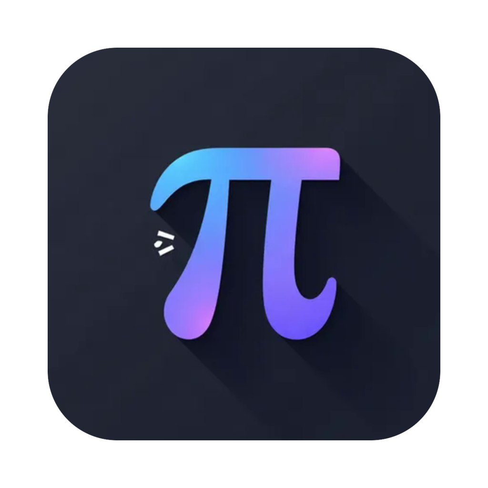
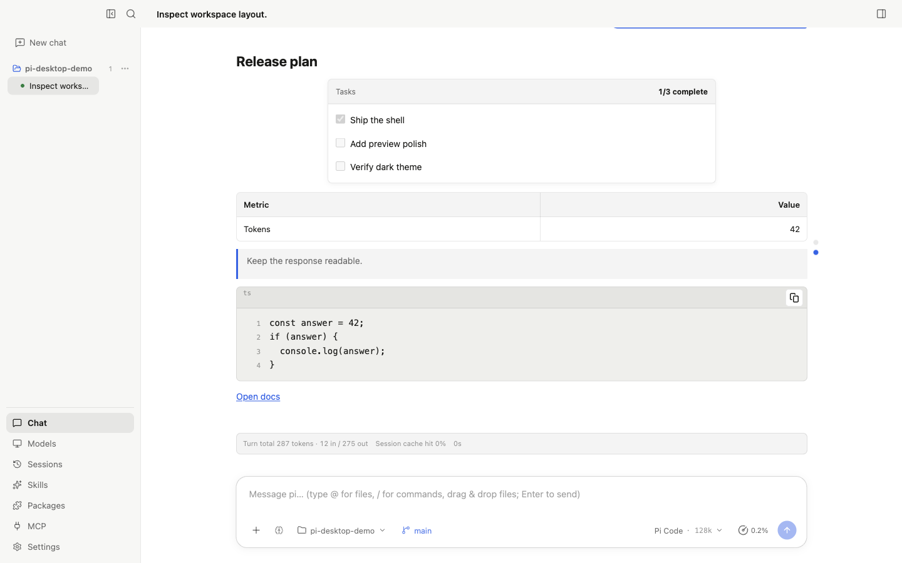
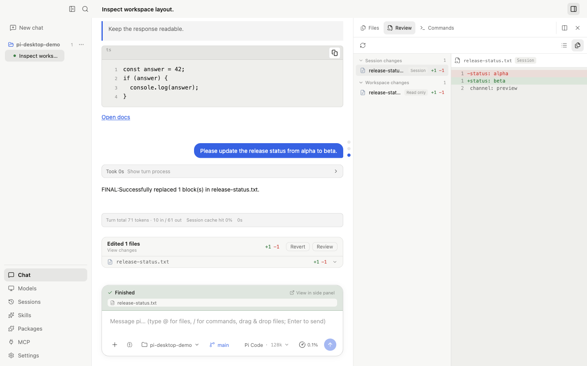
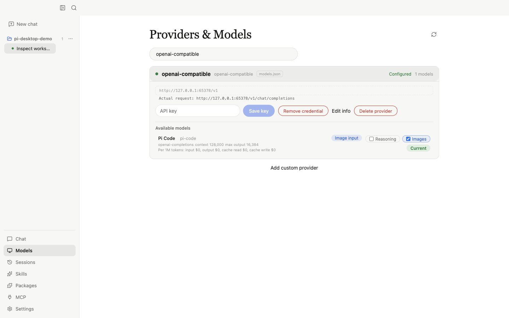
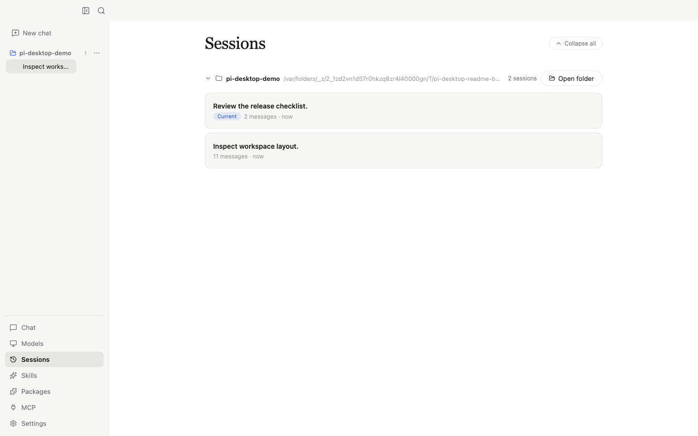
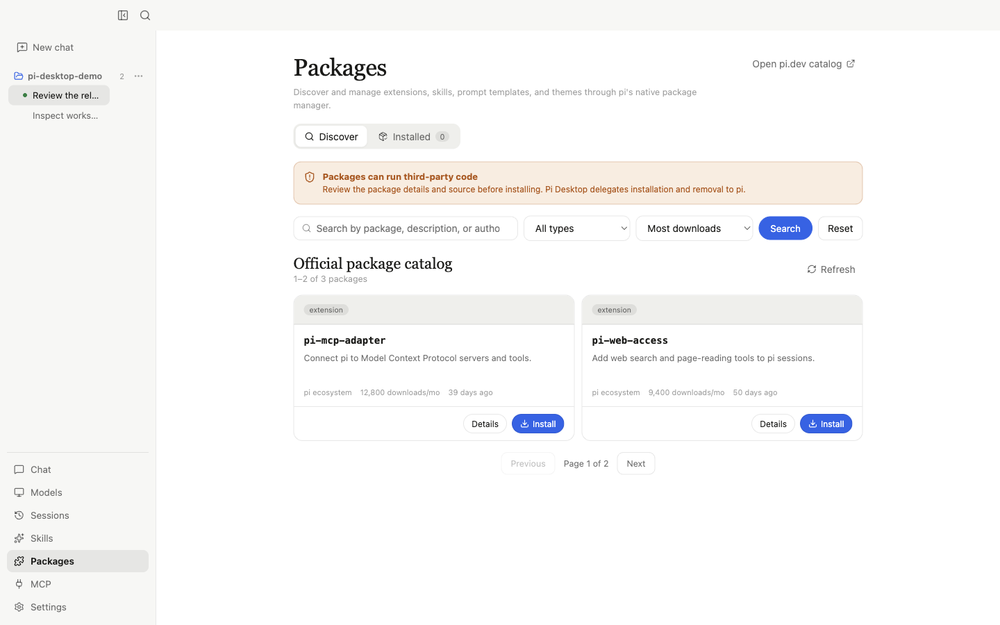

<div align="center">
  
  <h1>Pi Desktop</h1>
  <p><strong>A desktop workbench for the pi coding agent.</strong></p>
  <p>Chat, run tools, review code, manage sessions, and extend pi without leaving one focused app.</p>
  <p>
    <a href="README.md">English</a> ·
    <a href="README.zh-CN.md">简体中文</a>
  </p>
  <p>
    <a href="https://github.com/zth0828/pi-desktop/actions/workflows/ci.yml"></a>
    <a href="https://github.com/zth0828/pi-desktop/releases"></a>
    <a href="LICENSE"></a>
  </p>
</div>

Pi Desktop turns [pi](https://github.com/badlogic/pi-mono) into a native-feeling
desktop workspace without replacing its runtime. Models, sessions, tools,
skills, packages, extensions, and configuration still come from pi; the desktop
app makes those capabilities easier to see, control, and use every day.

> [!IMPORTANT]
> Pi Desktop does not bundle or fork pi. It loads the user's globally installed
> pi SDK and uses pi's native configuration and session files. The project is
> under active development; current downloads are unsigned preview builds.



## Why Pi Desktop

### One coding loop, not a collection of panels

Ask pi to investigate a project, follow its streaming work, inspect tool calls,
review the resulting files and diffs, then continue the same session. The
conversation, workspace, and change review stay connected.

### Native pi, with no second agent implementation

Pi Desktop does not run its own LLM loop or invent a desktop-only session
format. It adapts pi's SDK, events, settings, package manager, and extension
system. Work created in the desktop app remains pi work.

### Bring your own model stack

Use pi's built-in providers, API-key or OAuth authentication, custom
OpenAI-compatible endpoints, local servers such as LM Studio, and providers
registered by pi extensions. Inspect context limits and pricing, probe custom
connections, and switch the current model from the UI.

### Local-first project control

Your workspace, pi configuration, credentials, and session history stay in
their native local locations. Pi Desktop dynamically locates Node.js, npm, and
pi from your environment instead of bundling another runtime.

### Extensible through the pi ecosystem

Skills, prompt templates, themes, extensions, and MCP support remain pi-native.
Pi Desktop exposes discovery and configuration workflows while delegating the
actual installation and execution to pi.

## Feature Map

| Area | What is available |
| --- | --- |
| **Agent chat** | Streaming text and reasoning, tool-call progress, stop, queue and steer, slash commands, plan mode integration, rich Markdown, task lists, tables, code blocks, copy actions, file references, and image attachments |
| **Workspace** | Expandable file browser; text, code, image, Markdown, PDF, DOCX, XLSX and CSV previews; open files in native apps; responsive docked or overlay layout |
| **Change review** | Git and non-Git change detection, staged/unstaged/untracked/conflict states, split or unified diff, per-file and per-hunk revert confirmation, and edited-file summaries after each turn |
| **Sessions** | Project-grouped history, title/message search, rename, live-session indicators, switch, fork, branch tree, archive/restore, delete, context compaction, and standalone HTML export |
| **Models** | Built-in and extension providers, API keys, OAuth, custom compatible endpoints, protocol probing, model discovery, context/output limits, token pricing, thinking levels, usage and cost details |
| **pi ecosystem** | Read active Skills, browse the official package catalog, inspect package metadata and README files, install/update/remove packages, configure global/project MCP servers, and render supported extension dialogs/widgets/notifications |
| **Desktop experience** | Light/dark/system themes, English/Chinese UI, session search shortcut, collapsible sidebar, notification policy, send-key and follow-up behavior, prevent-sleep support, and pi environment diagnostics |

## Product Tour

### Chat and review code in the same workspace



The right-hand workbench keeps source files and changes next to the conversation.
Tool activity folds into a readable turn log, while edited files remain visible
for review or rollback.

### Use the model stack that fits the project



Credentials remain in pi's native storage. Pi Desktop adds a clear management
surface for provider status, available models, context windows, output limits,
and the active model.

### Treat sessions as durable project work



Sessions are not disposable chat tabs. Continue earlier work, fork an
alternative approach, archive completed threads, or export a self-contained
HTML record.

### Grow capabilities through pi packages



Discover extensions and skills, inspect their source and package details, then
let pi's native package manager handle installation. The screenshot uses an
isolated offline demo catalog with representative pi ecosystem package names.

## Architecture

The experience layer and capability layer have a strict boundary:

```text
React renderer
    │  window.pidesktop.hostInvoke (typed contract)
Electron main process
    │  service adapters + centralized event mapping
User-installed pi SDK / CLI
    │
models · sessions · tools · skills · packages · extensions
```

- The renderer never imports pi or reaches directly into Electron IPC.
- Main-process pi integrations are contained in `electron/services/`.
- pi events become desktop events in one shared mapper.
- pi, npm, and binary paths are discovered dynamically and compared using real
  paths, including macOS symlink normalization.
- Tests use isolated pi directories and local mock providers, never real model
  quota or personal session data.

## Requirements

- macOS, Windows, or Linux. Cross-platform packages are built by GitHub Actions;
  the project is still in preview and needs broader real-device validation.
- Node.js 22.19.0 or newer
- npm
- pnpm 10.32.1 (Corepack recommended)
- pi 0.83.0 or newer, globally installed through npm

Install pi:

```bash
npm i -g @earendil-works/pi-coding-agent
pi --version
```

## Download Preview Builds

Download the package for your platform from
[GitHub Releases](https://github.com/zth0828/pi-desktop/releases). Compare the
file against the published `SHA256SUMS-<platform>.txt` before opening it.

The macOS release workflow has two modes. When Apple credentials are available,
it produces Developer ID signed and notarized packages that open normally.
Without those credentials, it produces a fully ad-hoc signed preview and adds
`Install Pi Desktop.sh` plus installation instructions to the DMG. Run that
installer through Terminal to install without changing Privacy & Security
settings; direct Finder launch remains unavailable for unsigned applications.
Windows and Linux preview packages are also unsigned.

The `v0.1.0` macOS packages predate the bundled installer. After checking
`SHA256SUMS-macOS.txt`, install the app and remove quarantine from this app only:

```bash
xattr -dr com.apple.quarantine "/Applications/Pi Desktop.app"
```

Do not use `sudo spctl --master-disable`: it disables Gatekeeper globally for
every downloaded application. A system warning does not mean the download is
corrupt, but never bypass one for a file whose checksum or source you cannot
verify.

### macOS release signing

Tag releases require an active Apple Developer Program membership and these
GitHub Actions repository secrets:

- `MACOS_CSC_LINK`: base64-encoded `.p12` containing the Developer ID
  Application certificate and private key
- `MACOS_CSC_KEY_PASSWORD`: password used when exporting that `.p12`
- `APPLE_ID`: Apple account used for notarization
- `APPLE_APP_SPECIFIC_PASSWORD`: app-specific password for that account
- `APPLE_TEAM_ID`: the 10-character Apple Developer team ID

When all five secrets are present, the release job signs, notarizes, and checks
the app's sealed signature, Gatekeeper assessment, stapled notarization ticket,
and signed DMG. When they are absent, it deliberately uses ad-hoc signing and
verifies bundle integrity before publishing the terminal-based installer.

## Run from Source

```bash
git clone https://github.com/zth0828/pi-desktop.git
cd pi-desktop
corepack enable
pnpm install
pnpm dev
```

Pi Desktop checks Node.js, npm, the pi installation method, and pi version at
startup. Its onboarding flow can guide or run the supported npm installation
without taking over pi upgrades.

## Development

```bash
pnpm typecheck       # Main, preload, shared, and renderer TypeScript
pnpm test            # Unit tests
pnpm test:contract   # pi SDK contracts against a local SSE provider
pnpm test:e2e        # Electron end-to-end suite
pnpm build:vite      # Production renderer/main/preload build
```

Regenerate every README screenshot from isolated demo data:

```bash
pnpm screenshots:readme
```

## Project Status

The core desktop workflow is implemented and covered by Electron E2E tests.
CI validates source builds on macOS, Windows, and Linux. Version tags create
Developer ID signed and notarized macOS artifacts when Apple credentials are
configured, or ad-hoc signed previews with a terminal installer otherwise.
Windows and Linux preview artifacts remain unsigned. Auto-update and broader
real-device release validation remain future work.

## Contributing

[Issues](https://github.com/zth0828/pi-desktop/issues), bug reports, product
feedback, and focused pull requests are welcome.

1. Search existing issues and describe the user-facing problem or workflow.
2. Keep agent capabilities in pi or a pi extension; Pi Desktop should provide
   the experience and integration layer.
3. Add tests proportional to risk. Renderer UI changes require Electron
   Playwright coverage.
4. Run the relevant checks above before submitting.
5. Do not include secrets, API keys, or private pi sessions in reports.

## Community

Join the Pi Desktop community to ask questions, share workflows, and exchange
feedback with other users.

<table>
  <thead>
    <tr>
      <th>GitHub Community</th>
      <th>Feishu Group</th>
    </tr>
  </thead>
  <tbody>
    <tr>
      <td valign="top">
        <p>Use the project repository for public, searchable conversations:</p>
        <ul>
          <li><a href="https://github.com/zth0828/pi-desktop/issues">Issues</a> for reproducible bugs and focused feature requests.</li>
          <li><a href="https://github.com/zth0828/pi-desktop/discussions">Discussions</a> for questions, workflow ideas, and product feedback.</li>
          <li><a href="https://github.com/zth0828/pi-desktop/pulls">Pull requests</a> for focused contributions.</li>
        </ul>
      </td>
      <td align="center" valign="top">
        <a href="https://applink.feishu.cn/client/chat/chatter/add_by_link?link_token=e26gbe0e-6133-462d-9192-33c554ed5f47&amp;qr_code=true">
          
        </a>
        <br>
        <sub>Scan or click to join the Chinese-language group.</sub>
      </td>
    </tr>
  </tbody>
</table>

More community channels may be added as the project grows. Feishu group
availability and invite validity are controlled by Feishu and may change over
time.

## License

Pi Desktop is **free for personal, educational, research, and other
non-commercial use**. Commercial use requires prior written authorization from
the copyright holder. See [LICENSE](LICENSE) for the complete terms.

This is a source-available project, not an OSI-approved open-source license.
Third-party components retain their original licenses; see [NOTICE](NOTICE).

## Acknowledgements

- [pi](https://github.com/badlogic/pi-mono) provides the coding-agent runtime.
- A small number of Electron infrastructure files were adapted from ClawX under
  the MIT License. This is implementation-level reuse, not a product dependency
  or shared agent runtime. Exact attribution is recorded in [NOTICE](NOTICE),
  source comments, and the relevant commits.
